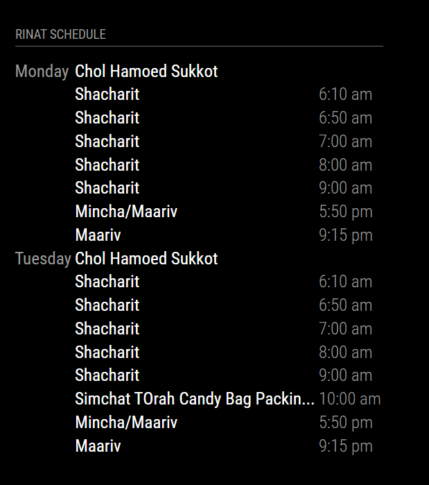

# MMM-ShulSchedule

MMM-ShulSchedule is a module for the MagicMirror² project. It displays the schedule for your local synagogue, including prayer times, events, and other important information.

It also allows for filtering the events collected, letting you only display what you care about.



## Installation

1. Navigate to your MagicMirror's `modules` folder:
    ```bash
    cd ~/MagicMirror/modules
    ```
2. Clone the repository:
    ```bash
    git clone https://github.com/yourusername/MMM-ShulSchedule.git
    ```
3. Navigate to the module's folder:
    ```bash
    cd MMM-ShulSchedule
    ```
4. Install the dependencies:
    ```bash
    npm install
    ```

## Configuration

To use this module, add it to the `modules` array in the `config/config.js` file of your MagicMirror² installation:

```javascript
{
    module: 'MMM-ShulSchedule',
    header: 'Shul Schedule',
    position: 'bottom_left',
    config: {
        fade: false,
        fetchInterval: 7200000, // 2 hours
        calendars: [
            {
                symbol: 'calendar',
                url: 'https://www.someshul.org/ical2.php?12,daed,schedule,mitzvah,parsha,holiday'
            },
        ],
        excludedEvents: [
            { filterBy: 'Daf Yomi', regex: false },
            { filterBy: 'Siddur', regex: false },
            { filterBy: 'Chavruta', regex: false },
            { filterBy: 'Ping Pong', regex: false },
            { filterBy: 'Ulpan', regex: false },
            { filterBy: 'Parshat HaShavua', regex: false },
            { filterBy: 'Parent Child Learning', regex: false },
            { filterBy: 'Tot', regex: false },
            { filterBy: 'Doctor', regex: false },
        ]
    }
}
```

## Configuration Options

| Option          | Description                                                                 | Type    | Default     |
|-----------------|-----------------------------------------------------------------------------|---------|-------------|
| `fade`          | Whether to fade out events as they get closer to the end time.              | Boolean | false       |
| `fetchInterval` | How often the schedule should be updated (in milliseconds).                 | Number  | 7200000     |
| `calendars`     | Array of calendar objects to fetch events from.                             | Array   | []          |
| `excludedEvents`| Array of event filters to exclude certain events from being displayed.      | Array   | []          |
| `excludedEvents.filterBy` | The string to match against event titles to determine if they should be excluded. | String  | ''          |
| `excludedEvents.regex`    | Whether the `filterBy` string should be treated as a regular expression.    | Boolean | false       |

## Example

Here is an example of how the module might look on your MagicMirror:


## Credits

This module is directly built upon the default Calendar module by Michael Teeuw (http://michaelteeuw.nl).

## License

This project is licensed under the MIT License - see the [LICENSE](LICENSE) file for details.
